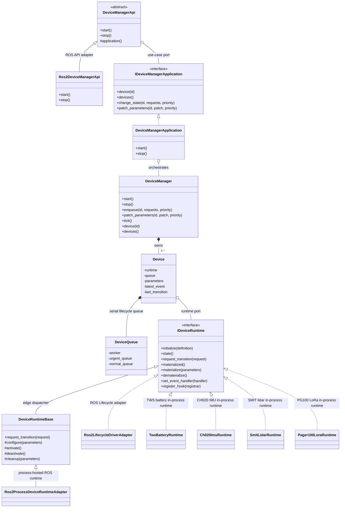

# Generic Device Manager Design

## Scope

This repository provides a generic device-management platform. It replaces the previous recovery-oriented prototype and contains a ROS-independent C++ core, ROS 2 contracts, a ROS-facing API adapter, a standard ROS Lifecycle driver adapter, generic ROS-device adapters, and concrete in-process runtime implementations.

The old connection, health, capability, and recover abstractions are intentionally not preserved.

## Layers

| Layer | Code | Responsibility |
| --- | --- | --- |
| External observation and operation | `DeviceManagerApi`, `Ros2DeviceManagerApi`, `device_manager_msgs` | Transport-facing API, ROS topics/services, request validation, and ROS/domain translation |
| Application and operation orchestration | `IDeviceManagerApplication`, `DeviceManagerApplication` | Use-case port, lifecycle submissions, parameter reconfiguration, observation queries, and periodic hook evaluation |
| Device-management core | `DeviceManager`, internal `Device`, `DeviceQueue` | Registration, one worker and priority queue per device, adjacent batch execution, stale filtering, and transition records |
| Runtime contract | Domain types and `IDeviceRuntime` | Authoritative state, materialization/dematerialization, one bounded transition call, event delivery, and one initialization-time hook |
| Startup wiring | `main()`, `load_device_registrations()` | Create concrete objects, load YAML registrations, and bind adapters without owning policy |
| Concrete drivers | `drivers/tws_battery_driver_ros2`, `drivers/ch020_imu_driver`, `drivers/smit_ros_driver`, `drivers/pager100_lora_bridge`, `drivers/gmsl_v4l2_camera_driver` | Device-specific protocol, transport, runtime plugin, and ROS topic publication |

ROS is an adapter boundary, not a core dependency. A future transport or driver type integrates by implementing `IDeviceRuntime`; it does not change queue or lifecycle policy.

## Core Classes



## Core Model

- Each device has one authoritative lifecycle state supplied by its `IDeviceRuntime`.
- Stable states are `FINALIZED`, `UNCONFIGURED`, `INACTIVE`, and `ACTIVE`; ROS lifecycle transition states are represented for observation.
- Device Manager extends the ROS 2 lifecycle graph with `FINALIZED <-> UNCONFIGURED`.
  `FINALIZED -> UNCONFIGURED` materializes the concrete runtime instance: a
  process-hosted runtime starts the ROS driver process, and an in-process
  runtime constructs its concrete driver object. `UNCONFIGURED -> FINALIZED`
  dematerializes it by stopping/reaping the process or destroying the driver
  object.
- The `IDeviceRuntime` object itself is always present and remains the state
  authority. `FINALIZED` means the runtime adapter exists but the concrete
  process or driver instance does not. This keeps the existing class graph:
  `Device -> IDeviceRuntime -> concrete adapter`; there is no extra shell layer.
- A runtime transition returns `SUCCESS`, `FAILURE`, or `ERROR`. The queue never commits a second state and reads the runtime state after every attempt.
- Each device owns one serial queue. One submission contains one or more adjacent `TransitionRequest` values and one priority shared by the whole submission.
- A request records its expected source and target state. If the source no longer matches at execution time, that request is discarded.
- `URGENT` submissions run before queued `NORMAL` submissions. Order is FIFO inside one priority.
- A batch stops at its first failed, errored, or discarded transition. The next tick evaluates the resulting real state again.

The framework never writes a second lifecycle state. Observation reads the runtime state, and a reported `SUCCESS` is normalized to `FAILURE` when the target state was not actually reached.

`device.enable` is the desired materialization gate. Automatic hooks consult it
at `FINALIZED`: `true` allows `FINALIZED -> UNCONFIGURED`, and `false` leaves the
device dematerialized. Disabling an already running device is an explicit
lifecycle path toward `FINALIZED`, such as `ACTIVE -> INACTIVE -> UNCONFIGURED
-> FINALIZED`; it is not a separate lifecycle state. A runtime that supports
dematerialization must make this path reliable and test it directly; a failed
disable/dematerialize path is treated as a runtime implementation defect, not a
second orchestration mode.

## Runtime Contract

`IDeviceRuntime` exposes `initialize()`, `state()`, `request_transition()`,
`parameter_transitions()`, `materialized()`, `materialize()`, `dematerialize()`,
`set_event_handler()`, and `register_hook()`.

`parameter_transitions()` is the required Runtime policy boundary for parameter
changes. Core passes the authoritative state at execution time, the complete
merged desired map, and the accumulated patch that has not yet been handled.
The Runtime may return an empty sequence when no lifecycle reaction is needed,
or return the adjacent transitions required to apply the change. Core owns
queueing and execution but does not interpret ordinary device parameters.

Built-in runtime names select the existing adapters. Any other `runtime` value
is a pluginlib lookup name; pluginlib constructs that concrete class directly
as an `IDeviceRuntime`, then `DeviceManager` calls `initialize()` once at
registration with the complete `DeviceDefinition`. The runtime owns its
execution model, including an in-process driver instance or a separate ROS 2
driver process and node. The class graph does not gain a plugin wrapper, and a
new driver does not require a driver-specific branch or build dependency in
Device Manager.

`DeviceRuntimeBase` is the optional helper for concrete runtimes that follow the
standard graph. It keeps `request_transition()` as the single framework entry
point, then dispatches lifecycle edges to `materialize()`, `configure()`,
`activate()`, `deactivate()`, `cleanup()`, and `dematerialize()`.

A runtime adapter is the permanent management object for one logical device. It
may own a child process handle, a ROS lifecycle client, or an optional
in-process driver instance, but those concrete resources may be absent while the
adapter reports `FINALIZED`.
The materialization methods describe that concrete resource boundary. Device
Manager still submits lifecycle requests and does not call them as a second
control path; runtimes use them internally for `FINALIZED -> UNCONFIGURED` and
`UNCONFIGURED -> FINALIZED`.

Events contain timestamp, level, namespaced code, source, message, target lifecycle state, and optional key/value details. An event updates observation data but does not directly mutate lifecycle state. A periodic framework tick invokes the driver's fixed initialization-time hook; the hook may return transition requests that are submitted normally.

The framework assigns each received event an internal monotonic revision. Hooks use that revision as event identity because vendor timestamps may be zero, duplicated, or adjusted. The revision is orchestration metadata and is not part of the public device observation.

The standard automatic hook has three policies:

1. At `FINALIZED`, materialize only when `device.enable=true`.
2. For an unhandled `ERROR` or `STALE` event, derive an adjacent path from the authoritative current state to the event's target state.
3. Otherwise, advance normal startup one edge per tick from `UNCONFIGURED` to `INACTIVE` and from `INACTIVE` to `ACTIVE`.

A failed external operation is not replayed by the hook. Fault recovery retries because the still-unhandled event causes the hook to derive another request on a later tick.

## TWS Battery Runtime

`drivers/tws_battery_driver_ros2` contains the first concrete driver. Its public
ROS output remains unchanged:

- package: `tws_battery_driver_ros2`
- standard topic: `/battery/state` (`sensor_msgs/msg/BatteryState`)
- detailed topic: `/battery/status` (`tws_battery_driver_ros2/msg/BmsStatus`)

Internally, the package is split into:

- `BatteryTransport`: transport contract; `SocketCanTransport` is the SocketCAN implementation.
- `TwsBatteryDriver`: protocol and polling core; no ROS node ownership.
- `TwsBatteryRuntime`: pluginlib-exported `IDeviceRuntime`, lifecycle hook, and topic owner.

The central Device Manager loads the runtime by
`tws_battery_driver_ros2/TwsBatteryRuntime`. The runtime starts at `FINALIZED`
until `device.enable=true` materializes the
concrete driver instance and advances `UNCONFIGURED -> INACTIVE -> ACTIVE`.
Poll failures emit a generic `DeviceEvent` with code `tws_battery.poll_failed`
and target `UNCONFIGURED`; a later tick then submits adjacent lifecycle requests
such as `ACTIVE -> INACTIVE -> UNCONFIGURED`, after which normal startup
retries.

## CH020 IMU Runtime

`drivers/ch020_imu_driver` contains the second concrete driver. Its public ROS
output remains unchanged:

- package: `ch020_imu_driver`
- topics: `/imu/data` (`sensor_msgs/msg/Imu`), `/imu/mag` (`sensor_msgs/msg/MagneticField`), `/imu/pressure` (`sensor_msgs/msg/FluidPressure`)

Internally, the package is split into:

- `SerialTransport`: transport contract; `PosixSerialTransport` is the POSIX termios implementation. The factory is injectable for tests.
- `HipnucDecoder`: byte-stream frame decoder, moved unchanged from the legacy package.
- `Ch020ImuDriver`: ROS-free core owning the serial read thread and the reconnect state machine.
- `Ch020ImuRuntime`: pluginlib-exported `IDeviceRuntime`, lifecycle hook, time synchronization, and topic owner.

The central Device Manager loads the runtime by
`ch020_imu_driver/Ch020ImuRuntime`. The runtime starts at `FINALIZED` until
`device.enable=true` materializes the
concrete driver instance and advances `UNCONFIGURED -> INACTIVE -> ACTIVE`. A configure
failure (serial port not openable) returns `ERROR` and emits
`ch020_imu.connect_failed` with target `UNCONFIGURED`, so the hook retries
configuration on later ticks instead of aborting the process.

Unlike the battery driver, runtime serial failures do not change lifecycle
state. The read thread detects both read errors (USB serial unplug) and data
stalls beyond `data_timeout_ms` (onboard UART unplug produces no read error),
closes the descriptor, and reopens it every `reconnect_backoff_ms` while the
lifecycle stays `ACTIVE`. Detection emits `ch020_imu.disconnected` (kError,
target `ACTIVE`, so the hook submits no recovery requests); a successful
reopen emits `ch020_imu.online` (kOk). The event source is `ch020_imu_driver`.

## PG100 LoRa Runtime

`drivers/pager100_lora_bridge` bridges the vehicle-side PG100 pager LoRa module.
Its public ROS output matches the retired standalone Python package:

- package: `pager100_lora_bridge`
- uplink topic: `/pager100/lora/rx` (`std_msgs/msg/UInt8MultiArray`)
- downlink topic: `/pager100/lora/tx` (`std_msgs/msg/UInt8MultiArray`)

Internally, the package is split into:

- `SerialFrameDecoder` / `encode_frame`: `0x7E` SOF framing with escape bytes and
  Modbus CRC16; ROS-free.
- `Pager100LoraDriver`: serial read thread and reconnect state machine; ROS-free.
- `Pager100LoraRuntime`: pluginlib-exported `IDeviceRuntime`, lifecycle hook, and
  topic owner. The runtime-owned node spins on a dedicated thread because the
  downlink subscription needs an executor the host does not provide.

The lifecycle and event contract mirrors the CH020 IMU runtime, with one
deliberate difference: an idle LoRa link is normal (no traffic when nobody
pages), so there is no data-stall detection — connection state only reflects
serial read/write health. The runtime cannot distinguish a dead module from a
quiet one. Event codes are `pager100.connect_failed`, `pager100.disconnected`,
and `pager100.online`; the event source is `pager100_lora_bridge`.

## Parameters

The manager keeps each device's complete desired in-memory parameter map. An accepted patch first merges into that map, then enters the same per-device queue as one atomic operation. This means queue submission confirms only that the desired map was updated; whether the runtime applied those values is reflected later by the transition result and observed lifecycle state. The worker derives its lifecycle path from the authoritative state when the operation actually starts; this avoids planning from a stale state while an earlier batch is running. The `UNCONFIGURED -> INACTIVE` request carries the complete map so the runtime can apply parameters before configuration.

Each accepted patch receives an internal per-device revision. A newer accepted
patch invalidates an older patch that has not started. The latest queued revision
receives the accumulated delta from every superseded patch, so the Runtime still
sees all parameter names whose desired values changed. A patch already executing
remains an adjacent, non-preemptible batch; the newer patch runs next and derives
a fresh path, so the final applied map is always the newest one.

For an active device the sequence is `ACTIVE -> INACTIVE -> UNCONFIGURED -> INACTIVE -> ACTIVE`.

Changing `device.enable` from `false` to `true` only changes the materialization
gate. The next automatic hook may then materialize a finalized device and follow
normal startup: `FINALIZED -> UNCONFIGURED -> INACTIVE -> ACTIVE`. Changing it
from `true` to `false` does not create a separate state; a running device is
disabled by submitting the explicit reverse dematerialization path to
`FINALIZED`.

## Runtime Flows

### Startup

1. `main()` creates the ROS node, declares startup parameters, and calls `load_device_registrations()`.
2. `load_device_registrations()` parses `instances`, flattens parameter values, and constructs the requested runtime adapter per definition.
3. `DeviceManager` validates IDs, runtime adapter presence, and duplicates.
4. `DeviceManagerApplication::start()` calls `DeviceManager::start()`, which installs each device's event handler and single fixed hook once through `Device::start()` and starts one worker per device, then starts the periodic hook tick thread.
5. `Ros2DeviceManagerApi::start()` creates the ROS publisher, services, and observation publication timer.
6. Whether a non-active state advances is determined only by the registered hook. The standard automatic hook materializes `FINALIZED -> UNCONFIGURED` only when `device.enable=true`, then advances `UNCONFIGURED -> INACTIVE -> ACTIVE`.

Restart has no persisted recovery state. Starting the process again follows the same discovery and initialization flow as the first start.

### Fault Recovery

```text
driver event -> latest observation + internal event revision
             -> periodic hook evaluates authoritative state
             -> adjacent transition requests enter the device queue
             -> bounded runtime transition succeeds/fails/errors
             -> next observation reads the authoritative state
             -> next tick retries while the event target remains unhandled
```

### Parameter Reconfiguration

```text
authoritative parameter service persists values (when persistence is needed)
  -> patch_parameters merges the platform's complete in-memory map
  -> queued patch derives a path from the state at execution time
  -> ACTIVE: ACTIVE -> INACTIVE -> UNCONFIGURED -> INACTIVE -> ACTIVE
  -> INACTIVE: INACTIVE -> UNCONFIGURED -> INACTIVE
  -> UNCONFIGURED: UNCONFIGURED -> INACTIVE
  -> FINALIZED: FINALIZED -> UNCONFIGURED -> INACTIVE
```

## ROS Layer

`device_manager_ros` provides the normal long-running ROS executable. `main()` owns process composition; `Ros2DeviceManagerApi` translates ROS requests and messages but does not own domain policy or concrete drivers.

`Ros2LifecycleDriverAdapter` maps lifecycle edges to standard `/change_state`, observes `/get_state`, applies parameters through `/set_parameters`, and forwards driver events.

A process-hosted ROS driver runtime uses the same `IDeviceRuntime` contract but
also owns process materialization. `runtime: ros2_process` starts the configured
ROS process at `FINALIZED -> UNCONFIGURED`, stops and reaps its process group at
`UNCONFIGURED -> FINALIZED`, and forwards the driver's `<node_name>/device_event`
stream. Device-specific health remains the driver's responsibility. This is a
concrete runtime adapter under `IDeviceRuntime`, not a new architectural layer.

A custom runtime uses its pluginlib lookup name as `runtime`. Its package
exports a default-constructible `IDeviceRuntime` implementation. The runtime
receives device identity, enablement, and the complete parameter map through
`initialize()` and may own either an in-process driver instance or a separate
driver process.

The host is a ROS lifecycle node. Its `configure` callback reads runtime metadata
from the `instances` YAML and loads each device's authoritative parameter map
from the configured parameter API. YAML `values` and
`process.parameters` are rejected to prevent two parameter sources. The default
`ros2_lifecycle` runtime uses optional `node_name` (defaults to `device_id`). The
`ros2_process` runtime uses `process.package`, `process.executable`, optional
`process.node_name`, optional `process.namespace`, optional
`process.parameter_mappings`. Mappings select and rename authoritative
parameters loaded from the configured parameter API. Only explicitly mapped parameters reach the
child. Any other runtime name is loaded through pluginlib.

The ROS API publishes `/device_manager/devices` and provides
`/device_manager/get_devices`, `/device_manager/change_device_state`, and
`/device_manager/patch_parameters`. It does not publish an aggregate event
topic. A child owned by `ros2_process` publishes events on its own
`<node_name>/device_event`; in-process plugins deliver events through
`IDeviceRuntime::set_event_handler`.

## Concurrency

- One worker thread executes each device queue.
- Queue storage and observation fields are protected independently.
- Event callbacks only update observation data.
- Driver callbacks are cleared before device destruction.
- API reads never access mutable observation records without synchronization.
- A hook exception is isolated to that device and tick; it cannot prevent later devices or future ticks from running.

## Failure Semantics

| Condition | Result |
| --- | --- |
| Unknown device, invalid priority/state, empty/non-contiguous batch | Submission is rejected and never enters a queue |
| Valid service request | `accepted=true` means queued only; it does not wait for completion |
| Source state changed before execution | Request is discarded, recorded, and the rest of its batch stops |
| Runtime returns `FAILURE` or `ERROR`, throws, or misses the target | Real state is read, the outcome is recorded, and the rest of its batch stops |
| Newer parameter patch supersedes an older queued patch | Older patch is discarded before applying stale parameters |
| Hook throws | Other devices still run; the same hook can be evaluated again on the next tick |
| Child process exits | The runtime emits `ros2_process.process_exited`; its hook enqueues a transition to `FINALIZED`, and automatic rematerialization then depends on `device.enable` |

## Deliberate Boundaries

- The process-hosted runtime starts and stops owned ROS processes and forwards driver events. Device Manager does not infer device health from business topics; the child driver must publish device events. The runtime does not implement restart backoff or stdout parsing.
- The framework does not detect other callers bypassing the ROS Lifecycle adapter. Exclusive `/change_state` ownership is an integration contract.
- Parameter persistence stays outside this process. The patch API changes the complete in-memory map and triggers reconfiguration.
- There is no independent health, connection, capability, pending-target, or recover model. Raw events plus lifecycle state are the atomic facts.

## Verification

Core tests cover lifecycle execution, stale request discard, batch adjacency, priority, hook retry, event observation, parameter reconfiguration, materialization gating, and shutdown. ROS tests cover request submission, state publication, configuration loading, diagnostics, hook recovery, and standard Lifecycle transition mapping.
